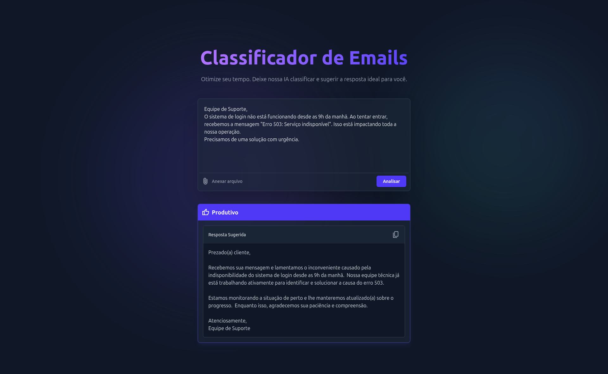

<div align="center">
<h1>Classificador Inteligente de Emails</h1>
<br>

<p>
  <em>Uma aplicação web full-stack que utiliza a API do Google Gemini para classificar emails e sugerir respostas automáticas, construída com uma interface moderna e responsiva.</em>
</p>

<p>
  
</p>

<a href="https://classificador-de-emails.vercel.app/">🚀 Acesse a Aplicação Online Aqui 🚀</a>

</div>

## 🎯 Visão Geral

No ambiente de uma empresa com alto volume de emails, a triagem manual consome um tempo valioso. Esta aplicação soluciona esse problema, automatizando a leitura e classificação de emails em **Produtivo** ou **Improdutivo** e sugerindo respostas profissionais e contextualizadas.

## ✨ Funcionalidades

- **Classificação Inteligente:** Análise do conteúdo do email para determinar sua categoria.
- **Respostas Sugeridas:** Geração de respostas automáticas e formatadas, prontas para uso.
- **Interface Dupla:** Permite a análise tanto de texto quanto de arquivos (`.txt` e `.pdf`).
- **Design Moderno:** Interface atraente e com foco na experiência do usuário (UX).
- **Feedback Interativo:** Botão de "Copiar Resposta" e estados de carregamento claros para uma interação fluida.

## 🛠️ Construído Com

| Área                        | Tecnologia                                           |
| :-------------------------- | :--------------------------------------------------- |
| **Frontend**                | React, TypeScript, Tailwind CSS, Framer Motion, Vite |
| **Backend**                 | Python, Flask, PyPDF2                                |
| **Inteligência Artificial** | Google Gemini API (modelo `gemini-1.5-flash-latest`) |
| **Deploy**                  | Vercel                                               |

---

## 💻 Executando Localmente

Siga os passos abaixo para configurar e rodar o projeto no seu ambiente de desenvolvimento.

### Pré-requisitos

Antes de começar, garanta que você tenha os seguintes softwares instalados:

- **Node.js**: `v22.12+`
- **Python**: `v3.9+`
- **pnpm**: `npm install -g pnpm`
- Uma **chave de API do Google Gemini** ([obtenha aqui](https://aistudio.google.com/))

### 🔧 Instalação

**1. Clone o repositório:**

```bash
git clone https://github.com/ndroher/classificador-de-emails.git
cd classificador-de-emails
```

**2. Configure o Backend (API):**

```bash
# Navegue até a pasta da API
cd api

# Crie e ative um ambiente virtual
python3 -m venv venv
source venv/bin/activate

# Crie um arquivo .env e adicione sua chave da API
# (substitua "SUA_CHAVE_AQUI" pela sua chave real)
echo "GEMINI_API_KEY=SUA_CHAVE_AQUI" > .env

# Instale as dependências Python
pip install -r requirements.txt
```

**3. Configure o Frontend:**

```bash
# Navegue até a pasta do frontend
cd ../frontend

# Instale as dependências Node.js
pnpm install
```

### ⚙️ Executando a Aplicação

Você precisará de dois terminais abertos.

**Terminal 1 - Iniciar o Backend**

```bash
# Dentro da pasta /api, com o venv ativo
python -m flask run
```

O backend estará rodando em http://127.0.0.1:5000 (default).

**Terminal 2 - Iniciar o Frontend**

```bash
# Dentro da pasta /frontend
pnpm dev
```

A aplicação estará acessível em http://localhost:5173 (default).
